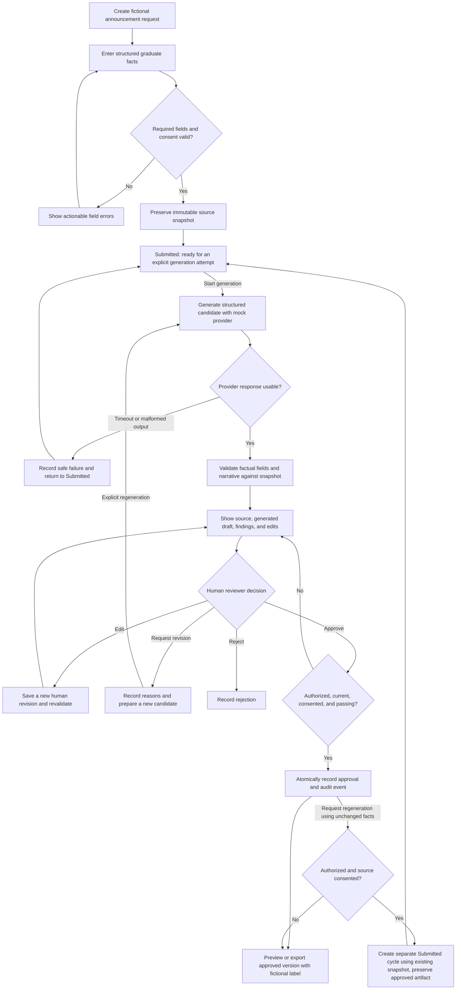
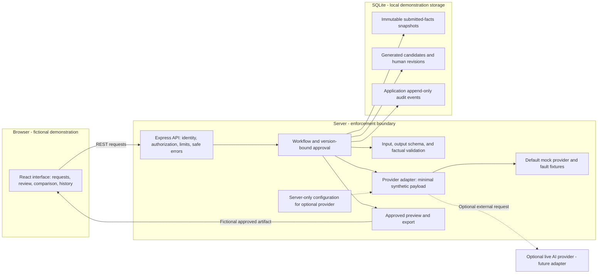
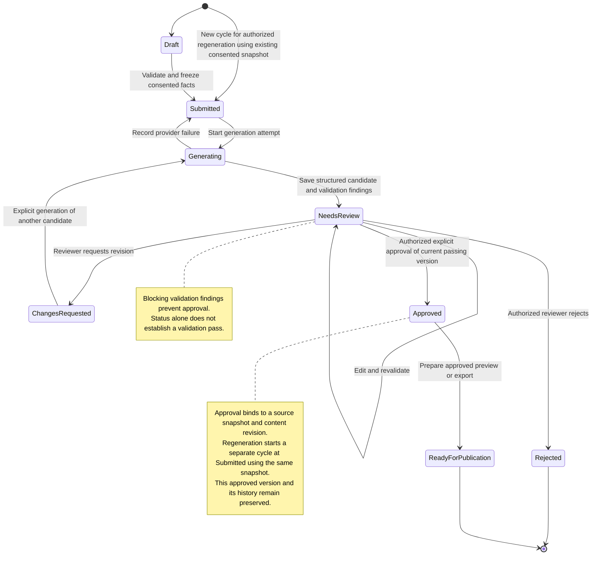
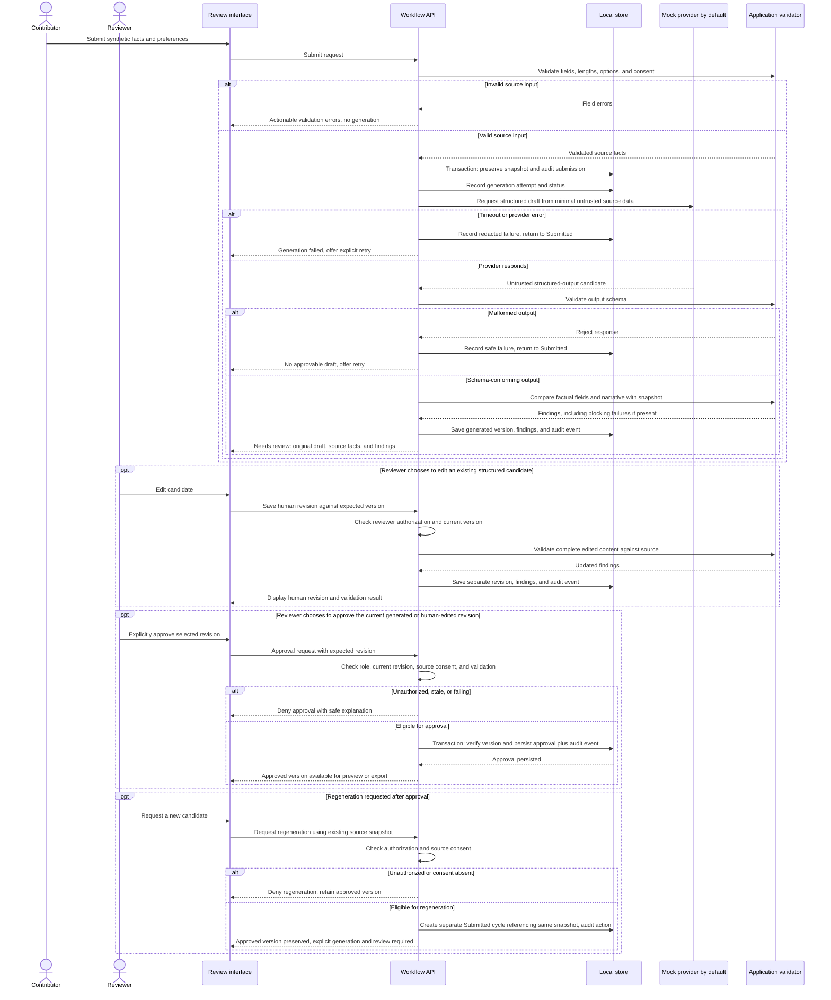

# Architecture and Workflow Drafts

**Phase 2 conceptual diagrams — not implemented or evaluated.** These independently proposed designs use only fictional demonstration data and do not document any private system. See the [disclaimer](DISCLAIMER.md) and [case-study draft](CASE_STUDY.md).

The proposed stack is React/Vite, TypeScript, Node.js/Express, runtime schema validation, and SQLite locally. The [Phase 3 technical specification](TECHNICAL_SPEC.md) now defines exact contracts, authorization mechanisms, storage constraints, and failure semantics. These diagrams remain conceptual; a PostgreSQL production path would need separate migration and integration verification.

## 1. End-to-end workflow

Audit events accompany submissions, generation attempts, revisions, decisions, and exports. The diagram highlights approval but does not imply that other actions lack auditing. Export is a local artifact handoff, not publication. A timeout or malformed response returns the current cycle to Submitted; an explicit retry starts generation with the same immutable snapshot. Regeneration after approval starts a separate Submitted cycle after authorization and consent checks, using the existing snapshot without contributor resubmission or re-freezing the facts. Correcting source facts instead starts at Draft and requires validation, submission, and a new immutable snapshot. Retry bounds and sensitive-error redaction will be specified in Phase 3.

## 2. Application architecture

Only the API would read or change persisted workflow data. The browser would receive neither provider credentials nor direct database access. Provider output is untrusted and must pass validation before it becomes eligible for approval. A provider cannot invoke review or publication actions.

The diagram shows intended responsibilities, not a set of microservices: these modules can run in one backend process. Local role simulation, if used, must be conspicuously labeled and cannot be represented as production authentication. Audit rows protected by application rules are not tamper-proof against privileged storage access.

## 3. Announcement status transitions

These are conceptual statuses for one review cycle. The two entry paths distinguish an initial Draft from a separate Submitted cycle created by authorized regeneration using an existing consented snapshot. Regeneration after approval does not re-freeze the facts or require contributor resubmission; it creates a separate cycle that must complete generation, validation, and human review. The existing approved version remains unchanged, which is why regeneration is a new entry rather than a transition out of Approved. Corrected source facts must follow the Draft submission path to create a new snapshot. Exact request-versus-version status storage belongs in Phase 3.

Rejected is terminal for that review cycle: the reviewer declines further work on it. Changes requested keeps the cycle open for revision and review. Pursuing content after rejection requires a new cycle; it does not reopen or alter the rejected record.

UI labels would read “Needs review,” “Changes requested,” and “Ready for publication.” The last means an approved artifact is prepared for handoff; it does not assert actual publication. `Published` is intentionally excluded from the initial demo because no publication or external distribution integration is proposed.

## 4. AI generation and validation sequence

Phase 3 must specify authorization failures for every mutation, concurrency conflicts, bounded provider retries, and stale generation responses. This conceptual sequence highlights the approval boundary; an unsuccessful check must never fall through to a write. Editing is optional: an unchanged generated candidate can be approved if its current revision passes all checks. Every human content revision would invalidate any previous validation result for that candidate, and approval would apply only to the checked revision. The regeneration block reuses the submitted snapshot without contributor resubmission; source corrections require the separate Draft submission path described above.

## Decisions resolved in the Phase 3 draft

- Two controlled prose templates allow exact comparison of headline, body, and social content against submitted facts; arbitrary paraphrase cannot pass approval checks.
- Requests group independently stored review cycles; immutable snapshots, revisions, validation runs, approvals, and artifacts preserve history.
- Server-issued sessions for conspicuously simulated local roles demonstrate API authorization without claiming verified identity.
- Pattern-based input screening, transactional application audit events, snapshot consent withdrawal, and whole-dataset reset define the local safeguards and their limits.

The [technical specification](TECHNICAL_SPEC.md) is authoritative for the proposed implementation contracts. In particular, submission and generation are separate explicit API actions; the conceptual sequence above compresses that handoff. Consent withdrawal and reset are detailed in the specification rather than added to these Phase 2 diagrams. No API implementation or working security guarantee is established by these drafts.
