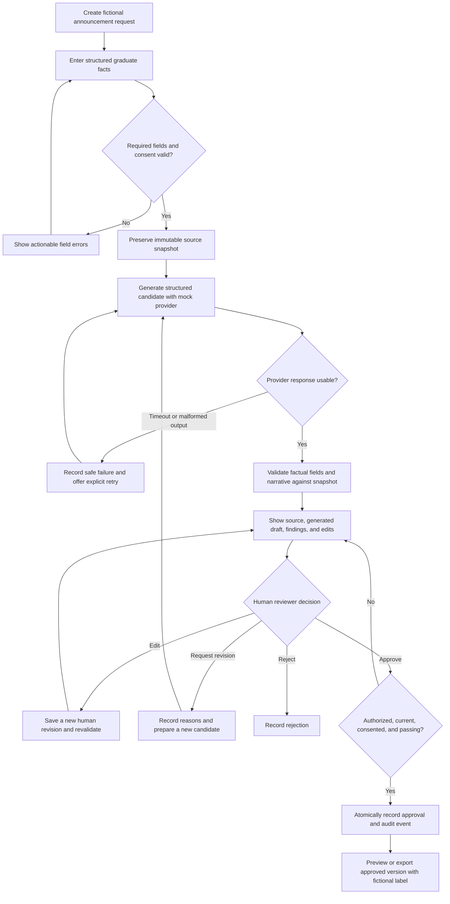
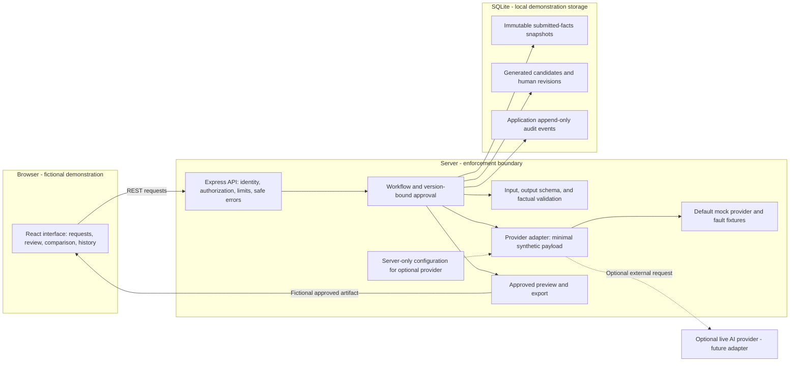

# Architecture and Workflow Drafts

**Phase 2 conceptual diagrams — not implemented or evaluated.** These independently proposed designs use only fictional demonstration data and do not document any private system. See the [disclaimer](DISCLAIMER.md) and [case-study draft](CASE_STUDY.md).

The proposed stack is React/Vite, TypeScript, Node.js/Express, runtime schema validation, and SQLite locally. Phase 3 will define exact contracts, authorization mechanisms, storage constraints, and failure semantics. A PostgreSQL production path would need separate migration and integration verification.

## 1. End-to-end workflow



Audit events accompany submissions, generation attempts, revisions, decisions, and exports. The diagram highlights approval but does not imply that other actions lack auditing. Export is a local artifact handoff, not publication. Correcting source facts requires a new source snapshot and a newly reviewed candidate; retries reuse the existing immutable snapshot. Retry bounds and sensitive-error redaction will be specified in Phase 3.

## 2. Application architecture



Only the API would read or change persisted workflow data. The browser would receive neither provider credentials nor direct database access. Provider output is untrusted and must pass validation before it becomes eligible for approval. A provider cannot invoke review or publication actions.

The diagram shows intended responsibilities, not a set of microservices: these modules can run in one backend process. Local role simulation, if used, must be conspicuously labeled and cannot be represented as production authentication. Audit rows protected by application rules are not tamper-proof against privileged storage access.

## 3. Announcement status transitions

```mermaid
stateDiagram-v2
    [*] --> Draft
    Draft --> Submitted: Validate facts and consent; freeze snapshot
    Submitted --> Generating: Start generation attempt
    Generating --> Submitted: Timeout or malformed response; record failure
    Generating --> NeedsReview: Save structured candidate and validation findings
    NeedsReview --> NeedsReview: Save human revision and revalidate
    NeedsReview --> ChangesRequested: Reviewer requests revision
    ChangesRequested --> Generating: Explicit generation of another candidate
    NeedsReview --> Rejected: Authorized reviewer rejects
    NeedsReview --> Approved: Authorized explicit approval of current passing version
    Approved --> ReadyForPublication: Prepare approved preview or export
    Rejected --> [*]
    ReadyForPublication --> [*]
    note right of NeedsReview
        Blocking validation findings prevent approval.
        Status alone does not establish a validation pass.
    end note
    note right of Approved
        Approval binds to a source snapshot and content revision.
        Regeneration creates a separate unapproved candidate.
        This approved version and its history remain preserved.
    end note
```



These are conceptual statuses for one review cycle. A request can retain an approved version while a separate candidate undergoes another review cycle. Regeneration after approval would begin a new cycle at Draft, reuse or explicitly replace the source snapshot, and require submission and review again. It would not move or overwrite the approved version shown here. Exact request-versus-version status storage belongs in Phase 3.

UI labels would read “Needs review,” “Changes requested,” and “Ready for publication.” The last means an approved artifact is prepared for handoff; it does not assert actual publication. `Published` is intentionally excluded from the initial demo because no publication or external distribution integration is proposed.

## 4. AI generation and validation sequence

```mermaid
sequenceDiagram
    actor Contributor
    actor Reviewer
    participant UI as Review interface
    participant API as Workflow API
    participant DB as Local store
    participant AI as Mock provider by default
    participant V as Application validator

    Contributor->>UI: Submit synthetic facts and preferences
    UI->>API: Submit request
    API->>V: Validate fields, lengths, options, and consent
    alt Invalid source input
        V-->>API: Field errors
        API-->>UI: Actionable validation errors; no generation
    else Valid source input
        V-->>API: Validated source facts
        API->>DB: Transaction: preserve snapshot and audit submission
        API->>DB: Record generation attempt and status
        API->>AI: Request structured draft from minimal untrusted source data
        alt Timeout or provider error
            API->>DB: Record redacted failure; return to Submitted
            API-->>UI: Generation failed; offer explicit retry
        else Provider responds
            AI-->>API: Untrusted structured-output candidate
            API->>V: Validate output schema
            alt Malformed output
                V-->>API: Reject response
                API->>DB: Record safe failure; return to Submitted
                API-->>UI: No approvable draft; offer retry
            else Schema-conforming output
                API->>V: Compare factual fields and narrative with snapshot
                V-->>API: Findings, including blocking failures if present
                API->>DB: Save generated version, findings, and audit event
                API-->>UI: Needs review: original draft, source facts, and findings
            end
        end
    end

    opt A structured candidate exists
        Reviewer->>UI: Edit candidate
        UI->>API: Save human revision against expected version
        API->>API: Check reviewer authorization and current version
        API->>V: Validate complete edited content against source
        V-->>API: Updated findings
        API->>DB: Save separate revision, findings, and audit event
        API-->>UI: Display human revision and validation result
        Reviewer->>UI: Explicitly approve selected revision
        UI->>API: Approval request with expected revision
        API->>API: Check role, current revision, source consent, and validation
        alt Unauthorized, stale, or failing
            API-->>UI: Deny approval with safe explanation
        else Eligible for approval
            API->>DB: Transaction: verify version and persist approval plus audit event
            DB-->>API: Approval persisted
            API-->>UI: Approved version available for preview or export
        end
    end

    opt Regeneration requested after approval
        Reviewer->>UI: Request a new candidate
        UI->>API: Start another review cycle
        API->>API: Check authorization
        API->>DB: Create separate unapproved candidate; preserve approved version
        API-->>UI: New cycle must complete submission, generation, and review
    end
```

Phase 3 must specify authorization failures for every mutation, concurrency conflicts, bounded provider retries, and stale generation responses. This conceptual sequence highlights the approval boundary; an unsuccessful check must never fall through to a write. Every human content revision would invalidate any previous validation result for that candidate, and approval would apply only to the checked revision.

## Review questions reserved for the specification

- How constrained should prose generation be to make independent factual validation defensible?
- How should request status, candidate status, and the retained approved version be represented without ambiguity?
- Which demo identity mechanism demonstrates server-side role enforcement while clearly stating its limitations?
- Which sensitive-input checks, audit protections, and retention controls are practical to demonstrate locally?

These are design decisions for Phase 3, not requests for confidential information. No schema, API implementation, or working security guarantee is established by these diagrams.
